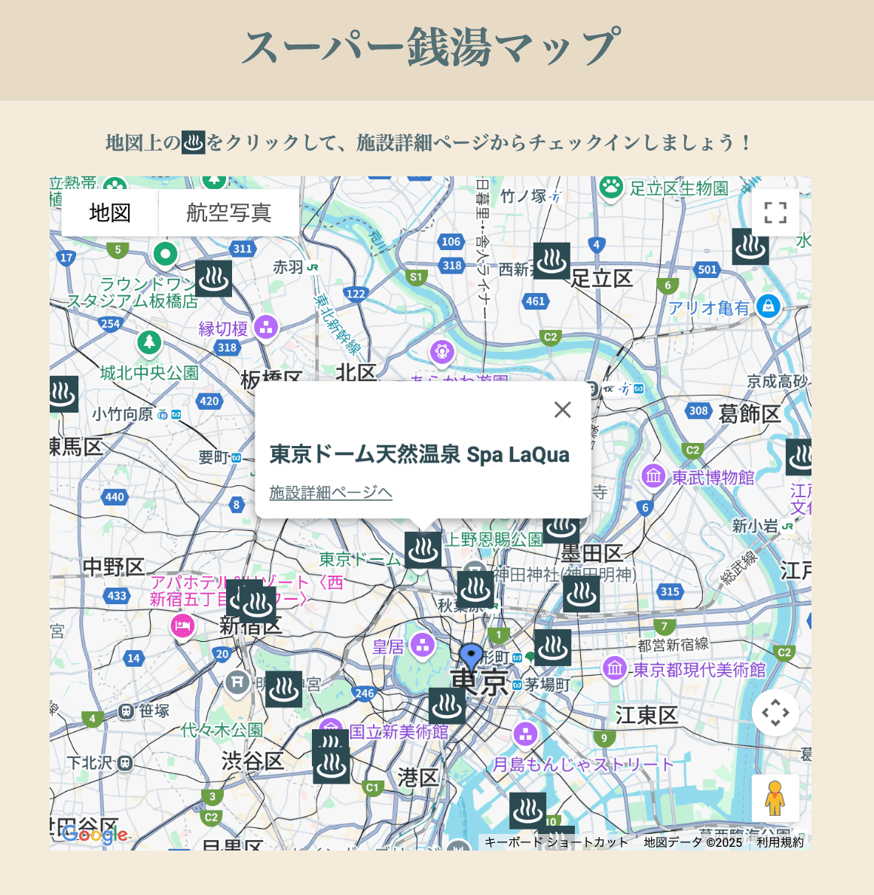
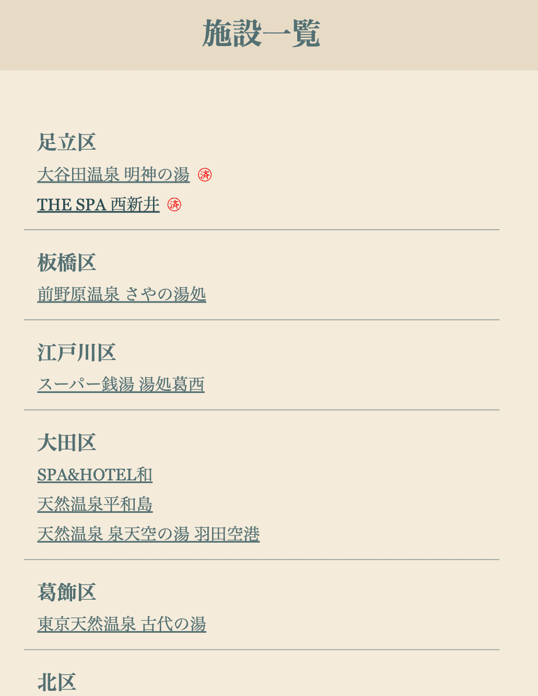
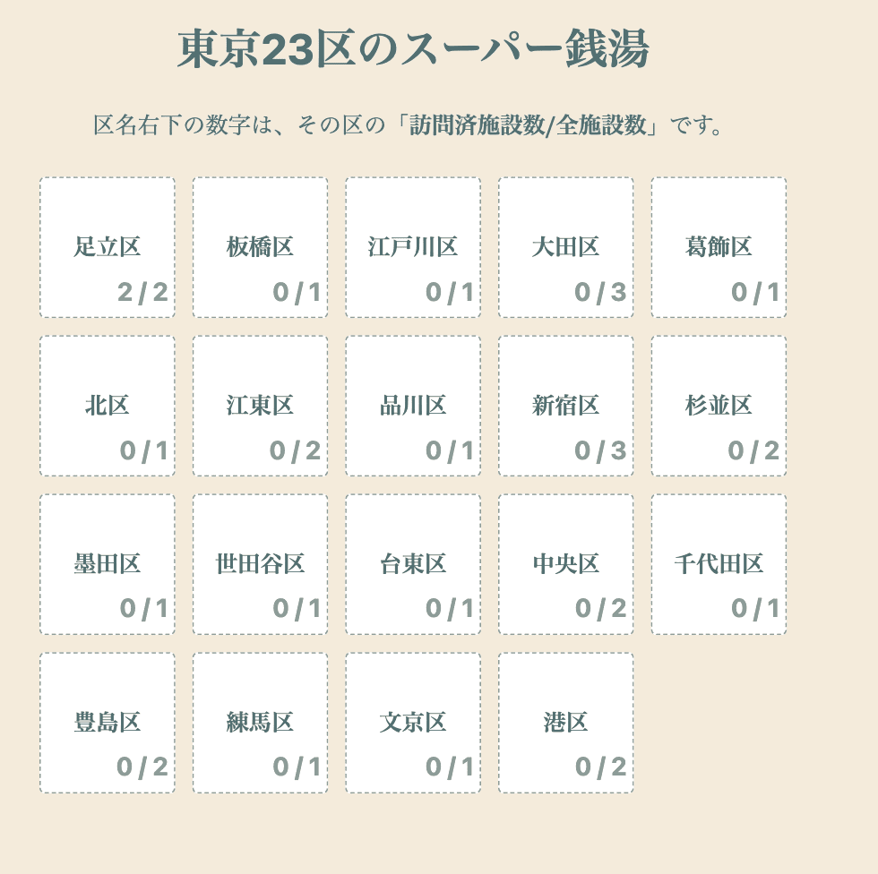

# スパコレ


## 🎯サービス概要

東京23区のスーパー銭湯全制覇を目指そう！

スパコレはGPS連動のスタンプラリーアプリです♨️🗾

このアプリで扱う「スーパー銭湯」の定義は以下です。

- サウナ特化型の施設ではないこと
- 浴料金が公衆浴場入浴料金ではないこと
- 男性専用・女性専用の施設ではないこと

サービスURL: https://spa-colle.com/

### 🌏スパコレに関するブログ記事

- リリースブログ:
- 開発ブログ:

## 🔍使い方

### 1️⃣東京23区のスーパー銭湯を探そう

現在地を中心としたスーパー銭湯マップか施設一覧から行きたい施設を探しましょう！

#### スーパー銭湯マップ



#### 施設一覧



### 2️⃣スーパー銭湯でチェックイン

スーパー銭湯を訪問したら、GPSチェックインをしましょう！

施設の200m以内にいるとチェックインできます👍

チェックインをすると訪問日が記録されます♨️

### 3️⃣目指せ全施設制覇！

GPSチェックインをすると、スタンプカードの訪問数が増えます👀

是非、全施設を巡ってみてください💪



## 🛠️使用技術

### Backend

- Ruby 3.4.4
- Ruby on Rails 8.0.2

### Frontend

- Hotwire
- Tailwind CSS
- Slim

### DB

PostgreSQL(NeonDB)

### Linter/Formatter

- RuboCop
- Slim-Lint
- ESLinst

### Test

RSpec

### インフラ

Render

### 外部サービス

Maps JavaScript API

## 💻ローカルでの環境構築

### アプリケーションのセットアップ

以下のコマンドを順番に実行して、アプリケーションのセットアップを行います。

```
git clone https://github.com/Judeeeee/spa-colle
```

```
cd spa-colle
```

```
bin/setup
```

### 環境変数の設定

このアプリでのログイン処理とGoogleマップの使用には環境変数の設定が必要です。

以下のコマンドを実行して、credentialファイルを編集してください。

```
EDITOR=vim bin/rails credentials:edit -e development
```

credentialファイルは以下のように指定してください。

```
google:
  client_id: GoogleのクライアントID
  client_secret: Googleのクライアントシークレット

google_map_api_key: GoogleMapAPIキー
```

### GoogleのクライアントIDとクライアントシークレット

以下の公式ドキュメントを参考にクライアントIDを取得してください。

https://developers.google.com/workspace/guides/create-credentials?hl=ja#oauth-client-id

その際、「承認済みのリダイレクトURI」には`http://localhost:3000/auth/google_oauth2/callback`を追加してください。

### GoogleMapAPIキー

以下の公式ドキュメントを参考にGoogleMapAPIキーを取得してください。

https://developers.google.com/maps/documentation/javascript/get-api-key?hl=ja

### サーバーの起動

以下のコマンドを実行してサーバーを起動し、ブラウザで`http://localhost:3000`にアクセスします。

```
bin/dev
```

### Lint

以下のコマンドを実行してください。

```
bin/lint
```

### テスト

テスト用のcredentialsファイルを作成する必要があります。

環境変数の設定を参考に、credentialsファイルを作成してください。

以下のコマンドを実行してください。

```
bundle exec rspec
```

## ❤️Contributing

スパコレはContributingを歓迎します🙌

もしお手伝いいただける方がいればご協力をお願いします🙇
